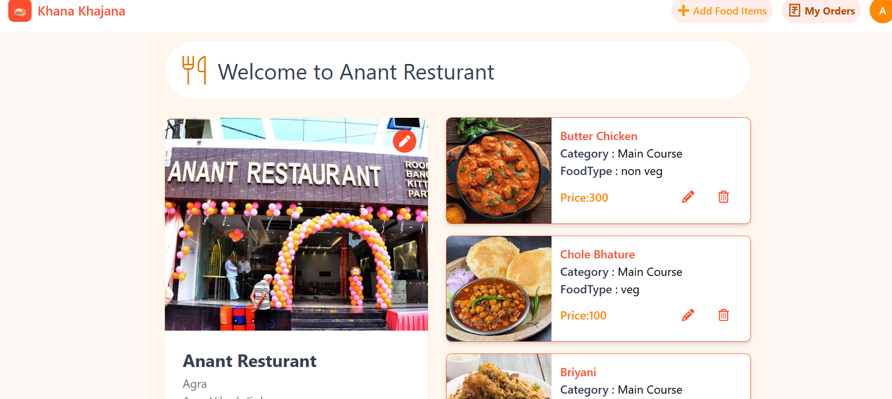
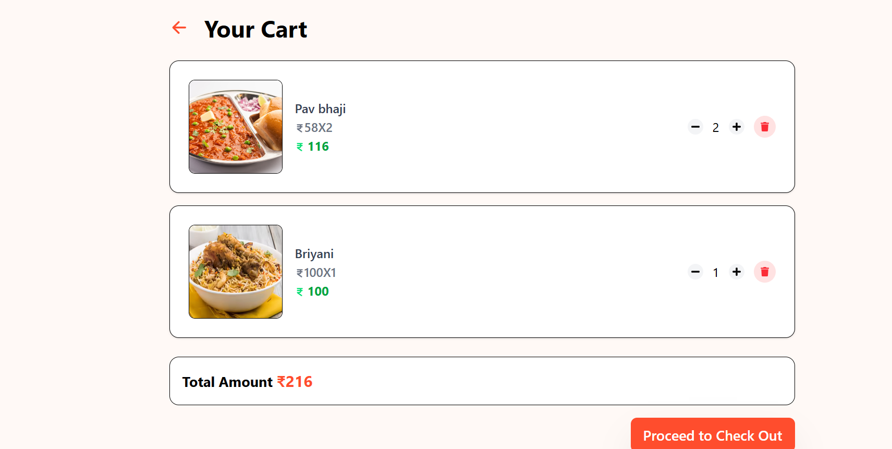
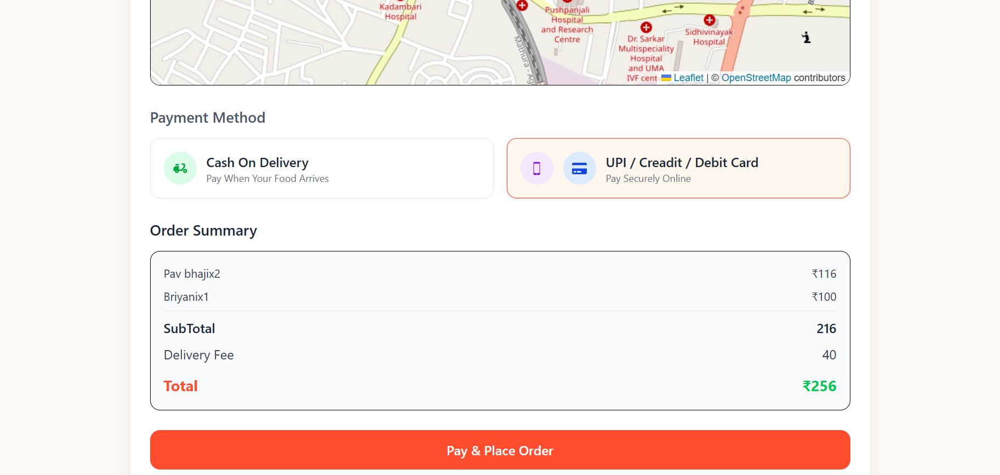
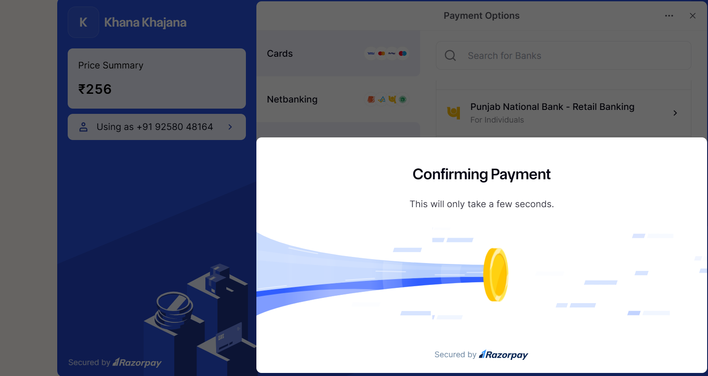
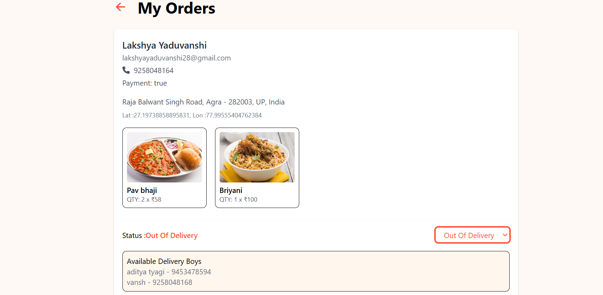
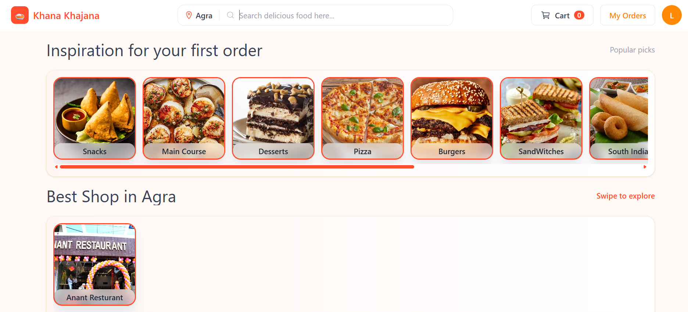
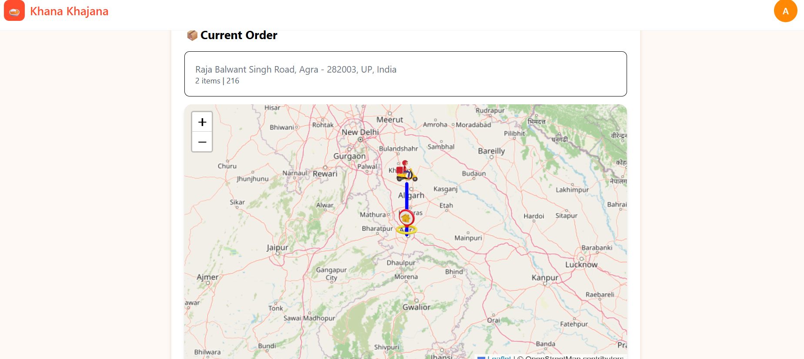

# 🍽️ Khana Khajana - Real-Time Food Delivery Platform

A full-stack food delivery web application built with the **MERN stack**, featuring real-time order tracking, live delivery updates, and role-based dashboards for customers, shop owners, delivery partners and an admin control room.

🔗 **Live Demo:** [khana-khajana-2ijn.onrender.com](https://khana-khajana-2ijn.onrender.com)

> ⚠️ Note: Hosted on Render's free tier - the backend may take 30-50 seconds to spin up on first load if it's been idle.

> 💳 Online payments run in Razorpay **test mode** - no real money is charged. Cash on delivery is also supported.

---

## 📌 Overview

Khana Khajana is a food-ordering platform - think Zomato/Swiggy at a much smaller scale - built around live order tracking, coordination between customer, shop and delivery partner, and payments.

It is an active project that keeps growing. Recent additions include a multi-city restaurant catalogue with real menus, an escrow-style payment flow (online payments held and settled, COD tracked), and an admin control room.

---

## ✨ Key Features

- **Four user roles** - Customer, Shop Owner, Delivery Partner and Admin, each with a dedicated dashboard and permissions
- **Real-time order tracking** - Live status updates (placed → preparing → out for delivery → delivered) synced instantly across roles using **Socket.io**
- **Live delivery location tracking** - Geolocation-based updates so customers can track their delivery partner in real time
- **Payments** - **Razorpay** integration (test mode) with server-side payment-signature verification, plus COD with settlement tracking
- **Shop & menu management** - Owners can create/edit shops, add items with images (via Cloudinary + Multer)
- **Multi-city catalogue** - Famous restaurants and dhabas per city with real menus and dish photos
- **Order lifecycle management** - Full flow from cart → checkout → assignment → delivery, with role-based state updates
- **Authentication** - Secure login/signup with cookie-based session handling (including Google OAuth)

---

## 🛠️ Tech Stack

**Frontend**
- React.js
- Redux Toolkit (global state management)
- Tailwind CSS

**Backend**
- Node.js + Express.js
- MongoDB + Mongoose (MongoDB Atlas)
- Socket.io (real-time bidirectional communication)

**Integrations & Tools**
- Razorpay (payment gateway, test mode)
- Cloudinary + Multer (image uploads)
- Firebase (Google OAuth)
- JWT / Cookie-based authentication
- Brevo (transactional email: OTPs and order alerts)

---

## 🏗️ Architecture Highlights

- **Event-driven real-time updates:** Socket.io events (e.g. `assignmentAccepted`, order status changes) keep customer, shop owner and delivery partner views in sync without polling.
- **Role-based access control:** Distinct dashboards and API permissions for each user type; the admin control room is restricted to the platform admin account.
- **Geospatial data:** Delivery locations stored and queried using MongoDB's GeoJSON `Point` type for live tracking.
- **Payment verification flow:** Server-side Razorpay signature verification before order confirmation, preventing client-side tampering.

---

## 📂 Project Structure

```
khana_khajana/
├── backend/          # Express server, REST APIs, Socket.io handlers, MongoDB models
├── frontend/          # React app, Redux store, role-based UI components
└── .gitignore
```

---

## 🚀 Getting Started

### Prerequisites
- Node.js (v18+)
- MongoDB Atlas account
- Razorpay test API keys
- Cloudinary account

### Installation

```bash
# Clone the repository
git clone https://github.com/Lakshya0604/khana_khajana.git
cd khana_khajana

# Setup backend
cd backend
npm install
# Add your .env file (see .env.example)
npm start

# Setup frontend
cd ../frontend
npm install
npm run dev
```

### Environment Variables

Create a `.env` file in the `backend` folder with:


A full-stack food delivery web application built with the **MERN stack**, featuring real-time order tracking, live delivery updates, and role-based dashboards for customers, shop owners, delivery partners and an admin control room.

🔗 **Live Demo:** [khana-khajana-2ijn.onrender.com](https://khana-khajana-2ijn.onrender.com)

> ⚠️ Note: Hosted on Render's free tier - the backend may take 30-50 seconds to spin up on first load if it's been idle.

> 💳 Online payments run in Razorpay **test mode** - no real money is charged. Cash on delivery is also supported.

---

## 📌 Overview

Khana Khajana is a food-ordering platform - think Zomato/Swiggy at a much smaller scale - built around live order tracking, coordination between customer, shop and delivery partner, and payments.

It is an active project that keeps growing. Recent additions include a multi-city restaurant catalogue with real menus, an escrow-style payment flow (online payments held and settled, COD tracked), and an admin control room.

---

## ✨ Key Features

- **Four user roles** - Customer, Shop Owner, Delivery Partner and Admin, each with a dedicated dashboard and permissions
- **Real-time order tracking** - Live status updates (placed → preparing → out for delivery → delivered) synced instantly across roles using **Socket.io**
- **Live delivery location tracking** - Geolocation-based updates so customers can track their delivery partner in real time
- **Payments** - **Razorpay** integration (test mode) with server-side payment-signature verification, plus COD with settlement tracking
- **Shop & menu management** - Owners can create/edit shops, add items with images (via Cloudinary + Multer)
- **Multi-city catalogue** - Famous restaurants and dhabas per city with real menus and dish photos
- **Order lifecycle management** - Full flow from cart → checkout → assignment → delivery, with role-based state updates
- **Authentication** - Secure login/signup with cookie-based session handling (including Google OAuth)

---

## 🛠️ Tech Stack

**Frontend**
- React.js
- Redux Toolkit (global state management)
- Tailwind CSS

**Backend**
- Node.js + Express.js
- MongoDB + Mongoose (MongoDB Atlas)
- Socket.io (real-time bidirectional communication)

**Integrations & Tools**
- Razorpay (payment gateway, test mode)
- Cloudinary + Multer (image uploads)
- Firebase (Google OAuth)
- JWT / Cookie-based authentication
- Brevo (transactional email: OTPs and order alerts)

---

## 🏗️ Architecture Highlights

- **Event-driven real-time updates:** Socket.io events (e.g. `assignmentAccepted`, order status changes) keep customer, shop owner and delivery partner views in sync without polling.
- **Role-based access control:** Distinct dashboards and API permissions for each user type; the admin control room is restricted to the platform admin account.
- **Geospatial data:** Delivery locations stored and queried using MongoDB's GeoJSON `Point` type for live tracking.
- **Payment verification flow:** Server-side Razorpay signature verification before order confirmation, preventing client-side tampering.

---

## 📂 Project Structure

```
khana_khajana/
├── backend/          # Express server, REST APIs, Socket.io handlers, MongoDB models
├── frontend/          # React app, Redux store, role-based UI components
└── .gitignore
```

---

## 🚀 Getting Started

### Prerequisites
- Node.js (v18+)
- MongoDB Atlas account
- Razorpay test API keys
- Cloudinary account

### Installation

```bash
# Clone the repository
git clone https://github.com/Lakshya0604/khana_khajana.git
cd khana_khajana

# Setup backend
cd backend
npm install
# Add your .env file (see .env.example)
npm start

# Setup frontend
cd ../frontend
npm install
npm run dev
```

### Environment Variables

Create a `.env` file in the `backend` folder with:

```
PORT=5000
MONGODB_URI=your_mongodb_atlas_uri
JWT_SECRET=your_jwt_secret
RAZORPAY_KEY_ID=your_razorpay_key
RAZORPAY_KEY_SECRET=your_razorpay_secret
CLOUDINARY_CLOUD_NAME=your_cloud_name
CLOUDINARY_API_KEY=your_api_key
CLOUDINARY_API_SECRET=your_api_secret
```

---

## 📸 Screenshots

**Customer Flow**
| Home / Browse | Cart | Checkout & Payment |
|---|---|---|
|  |  |  |

| Razorpay Payment | Order Tracking | Order History (with ratings) |
|---|---|---|
|  |  |  |

**Shop Owner Dashboard**
| Restaurant & Menu Management |
|---|
|  |

**Delivery Partner Dashboard**
| Live Location Tracking on Map |
|---|
|  |

## 🔮 Future Improvements

- [ ] Switch Razorpay from test mode to live payments (requires KYC)
- [ ] Push notifications
- [ ] Re-order feature

---

## 👤 Author

**Lakshya Yadav**
B.Tech Computer Science | MERN Stack Developer
[LinkedIn](https://www.linkedin.com/in/lakshya-yadav-32a692312/) • [GitHub](https://github.com/Lakshya0604)

---

⭐ If you find this project interesting, consider giving it a star!
